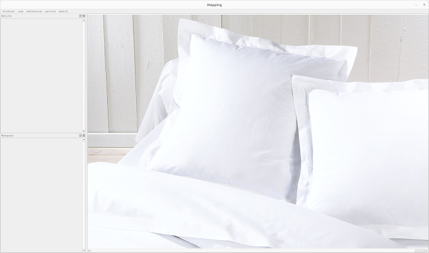
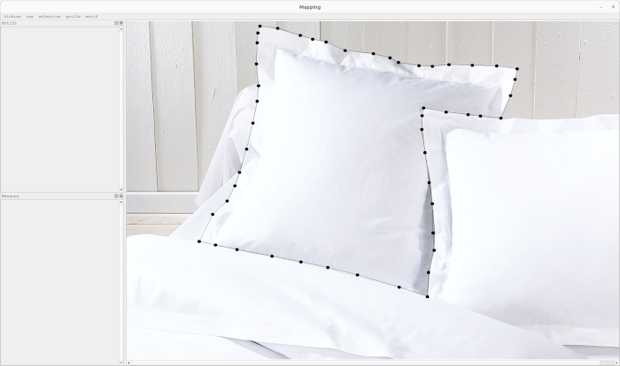
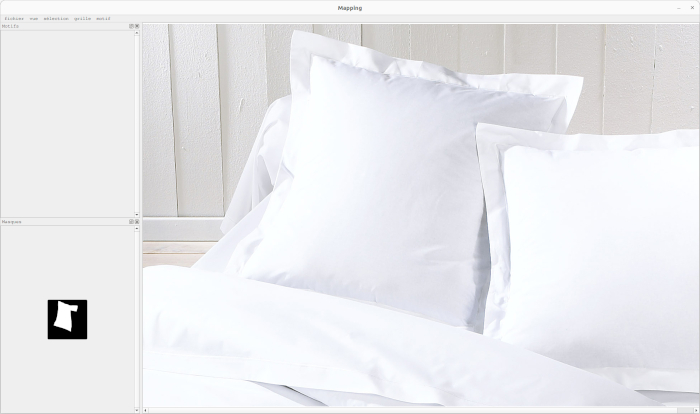
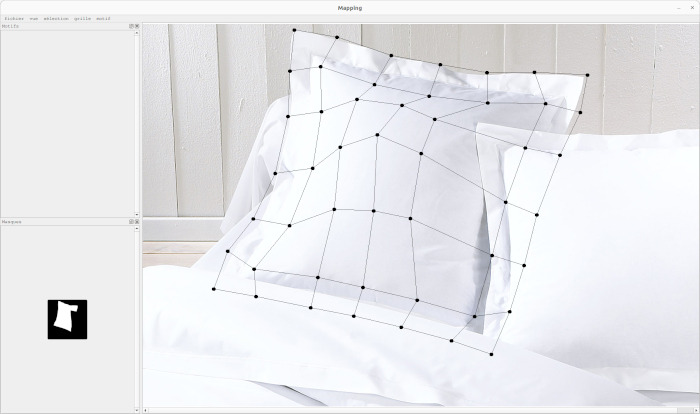
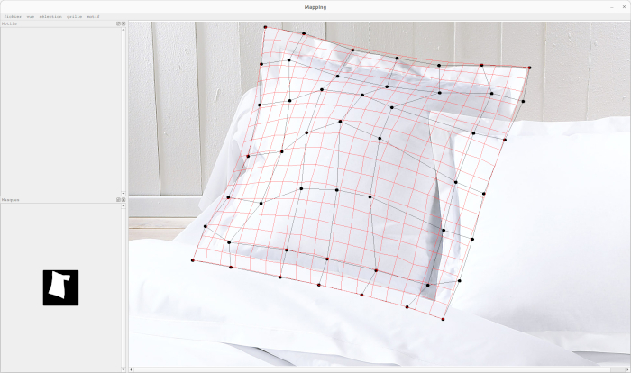
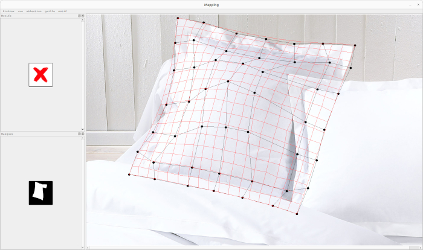
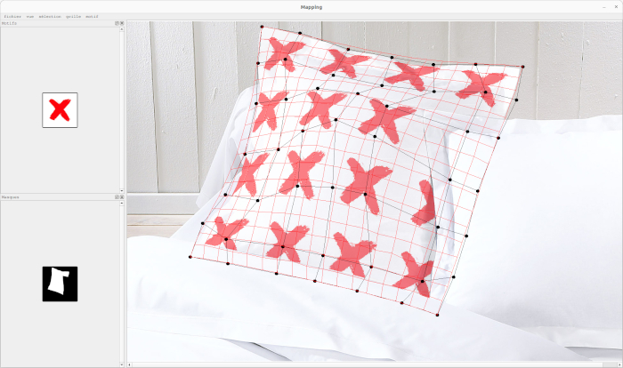
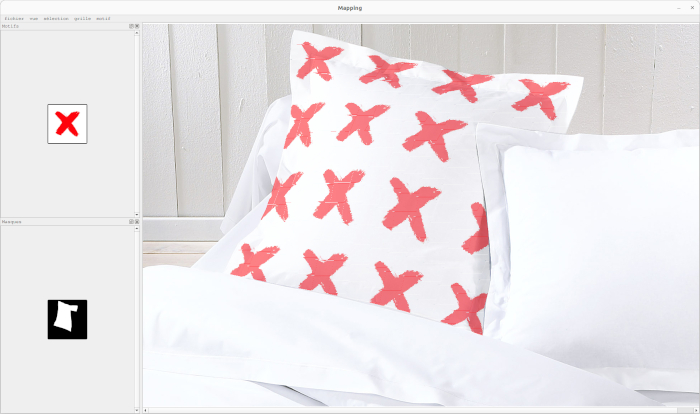

# FabricsMapping

<p>
A software made to help visualizing the appearance of patterns used in textile designing on bedding fabrics.<br/>
To do so, a 2D pattern is mapped on a bezier surface generated by a grid placed on a specific area of an input image.<br/>
<p/>
<p>
Implementation done in C++ with Qt5 for the GUI system.
<p/>

## Dependencies

- [Conan](https://conan.io/)
- [CMake](https://cmake.org/)

## Build

```
conan install . -s build_type=Release --build missing --install-folder=build
cmake -B build -S .
```

## Demo

### step 1 : Open an image



### step 2 : Create a shape that encloses the area on we want 



### step 3 : Hit enter to create a mask



### step 4 : Create a grid and move its control points around an object



### step 5 : Generate a bezier surface from the grid



### step 6 : Open a pattern



### step 7 : Map the pattern on the bezier surface



### step 8 : Hide the bezier surface and the grid from the view


